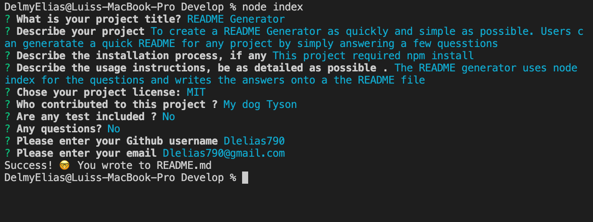

# README-Generator
  README Generator 👨‍💻
  
  Live URL: https://dlelias.github.io/README-Generator/

  ## Description 
  To create a README Generator as quickly and simple as possible. Users can generatate a quick README for any project by simply answering a few quesstions
  
  
  
  ##Demo
  [README_vid.mp4 3.zip](https://github.com/Dlelias/README-Generator/files/7605353/README_vid.mp4.3.zip)
  

  

  ## Table of Contents:
- [Description](#description)
- [Installation](#installation)
- [Usage](#usage)
- [License](#license)
- [Contributing](#contributing)
- [Tests](#tests)
- [Questions](#questions)

## Installation
This project required npm install 

## Usage
The README generator uses node index for the questions and writes the answers onto a the README file  💾

## License 

This application is covered by the MIT license. 

## Contributions
My dog Tyson  👥

## Tests
No 📝

## Questions
No ❓ 

Find me on Github: 🤙 [Dlelias790](https://github.com/Dlelias790)

Feel free to email me if you have any questions 🌈: Dlelias790@gmail.com
